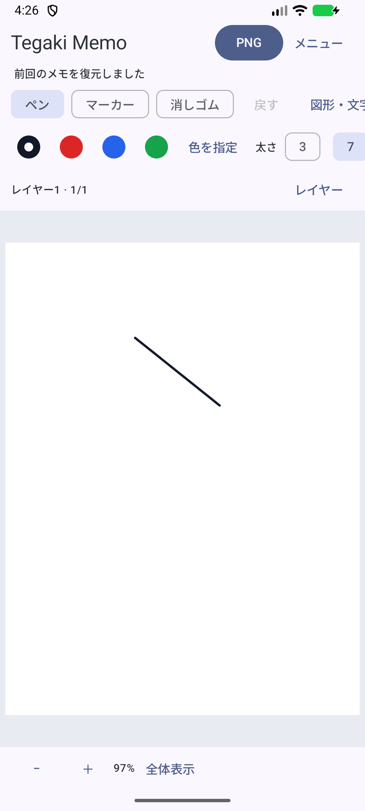

# Tegaki Memo — Android APK配布

Kotlin + Jetpack Composeによる手書きメモアプリのAndroid版です。
このリポジトリはAPKと利用者向け説明の配布専用です。Androidアプリのソースコードは含みません。
PWA版は別プロジェクトです。このページで配布するファイルはAndroidアプリです。

## ダウンロード

[Releases](https://github.com/kgymk1-hub/TegakiMemo-Releases/releases) から `TegakiMemo-v1.0-beta.1.apk` を取得してください。
初回はβ版です。重要なメモは `.tegaki` 形式で別途保存してください。
「Source code (zip/tar.gz)」はこの配布ページの資料で、インストール用アプリではありません。

## 対応環境

Android 8.0以上（minSdk 26）。Android 12のOPPO実機とAndroid 17/API 37エミュレータで機能を検証しています。
配布用署名APKの最終確認はAPI 37エミュレータです。Android 8実動作、物理スタイラス、実タブレット、TalkBack音声での全操作は未確認です。

## インストールと更新

1. スマートフォンでAPKをダウンロードし、開きます。
2. 必要な場合、そのブラウザ／Filesに対して「不明なアプリのインストール」を許可します。
3. インストール後、不要になった許可は戻してください。

更新はこの配布ページの新しいAPKをダウンロードして上書きインストールします。自動更新機能はありません。
更新前にも大切なメモを.tegakiへ保存してください。

**以前の開発用アプリを入れている場合**：正式署名とは鍵が異なるため、そのまま上書きできません。
既存メモを.tegakiへ書き出して安全な場所へ保存してから、開発用アプリを削除し、本APKを入れてファイルを読み込んでください。
アプリを削除すると内部メモは消えます。書出し前に削除しないでください。
「Tegaki Memo 検証用」は別アプリで、メモを共有しません。

## 主な機能

- ペン・マーカー・消しゴム、色・太さ、Undo
- PNG保存、画像読込と移動・拡大縮小・回転
- 自動保存、キャンバスサイズ変更、ピンチズーム
- 最大5レイヤー、図形・文字、選択・コピー・切取り・貼付け
- PWA版と互換の.tegaki読込／保存（Android版の上限内）

## 保存と制限

作業中のメモ1件を自動保存します。別のメモに切り替える前に.tegakiで書き出してください。
PNGは合成画像、.tegakiはレイヤー付きの編集データです。
各辺100〜4000px、キャンバス800万画素、レイヤー合計1600万画素、読込ファイル64MiBまで。
Undoは最大10操作で、アプリ終了後の履歴復元はありません。文字は確定後に画像化されます。
保存完了前の強制終了や電源断では最後の変更を失う場合があります。

## データの取扱い・問い合わせ

[データの取扱い](PRIVACY.md)、[第三者ライブラリ](THIRD_PARTY_NOTICES.md) を参照してください。
提供者：kgymk1-hub。問い合わせ・不具合報告は [Issues](https://github.com/kgymk1-hub/TegakiMemo-Releases/issues) へ。
公開の場なので個人情報や私的なメモ画像を投稿しないでください。

## 画面例

